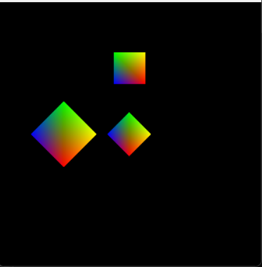

# Shape Task - OpenGL

## 📌 Project Overview
A simple graphics project built using **C++** and **OpenGL (GLUT)**.  
Demonstrates drawing **colorful shapes** with transformations such as **translation, scaling, and rotation**.

---

## 🎯 Features
- Draws a **diamond-shaped quad** in the center  
- Applies **translation**, **scaling**, and **rotation** on multiple instances  
- Uses **vertex coloring** for gradient effect  
- Demonstrates **push/pop matrix** for transformation isolation  

---

## 🛠 Technologies Used
- **C++**
- **OpenGL**
- **GLUT (OpenGL Utility Toolkit)**

---

## 📷 Demo / Screenshot
  


---

## 🚀 How to Run
1. Install OpenGL and GLUT on your system.  
2. Compile the project using a C++ compiler:  
```bash
g++ main.cpp -lglut -lGL -lGLU -o ShapeTask
